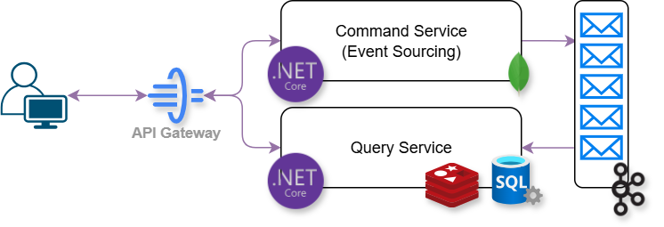

# Pixogram
Pixogram is a sample project built with **.NET 9**, showcasing a modern microservices-style architecture using **CQRS** and **Event Sourcing**.  
It demonstrates how to split command and query responsibilities, synchronize data with Kafka, and improve performance with caching.

## 🚀 Features

- **CQRS Pattern**: Separation of command and query responsibilities.
- **Event Sourcing**: Command side stores events in **MongoDB**.
- **Query Projection**: Query side uses **SQL Server**, updated via **Kafka**.
- **YARP Gateway**: A single entry point for clients, routing requests to Command or Query.
- **Caching Layer**: Uses **Redis** with **Cache-Aside Pattern** for fast queries.
- **Mediator Pattern**: Both Command and Query projects use Mediator for handling requests.
- **Docker Compose**: Infrastructure dependencies (Kafka, Redis, SQL Server, MongoDB) run with a single command.
- **Postman Collection**: Provided for quick and easy testing.

## 🛠️ Tech Stack

- **.NET 9**
- **MongoDB** (Command + Event Store)
- **SQL Server** (Query side projection)
- **Kafka** (Event streaming between Command and Query)
- **Redis** (Query caching, Cache-Aside)
- **YARP** (Gateway)
- **Mediator Pattern**
- **Docker Compose**

## 📂 Project Structure
```
Pixogram/
│── src/
│ ├── Pixogram.Gateway # YARP API Gateway
| ├── CQRS.Core
| ├── Post
│     ├── Command # Command side (Event Sourcing, MongoDB)
|     ├── Common  # Common Events
│     ├── Query   # Query side (SQL Server + Redis)
│── docs/
│ ├── Pixogram.postman_collection.json
│ ├── architecture.png
│── docker-compose.yml
│── README.md
```
---

## 🏗️ Architecture

The architecture is based on **CQRS + Event Sourcing** with Kafka as the backbone for syncing command events into query projections.



---

## ⚡ Getting Started

### 1. Clone the repository
```bash
git clone https://github.com/arminyaghoubi/Pixogram.git
cd Pixogram
```
### 2. Run infrastructure with Docker Compose
Make sure you have Docker installed, then run:
```bash
docker-compose up -d
```
### 3. Run the projects
### 🧪 Testing the APIs

Import the Postman collection:
[📥 Download Pixogram.postman_collection.json](docs/Pixogram.postman_collection.json)  


Use the pre-configured requests to test commands (create/update) and queries (read data).

### 🤝 Contributing

Pull requests are welcome! For major changes, please open an issue first to discuss what you would like to change.
